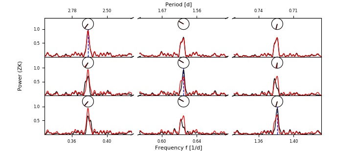

# The AliasFinder

The AliasFinder is a Python script for uncomplicated alias testing based on the method introduced by [Dawson & Fabrycky (2010)](https://ui.adsabs.harvard.edu/abs/2010ApJ...722..937D/abstract). It provides publication quality plots.
The original method is coupled with a Monte-Carlo approach to evaluate also the impact of noise on the data.

## Requirements
The AliasFinder is written in Python 3 and should run with a standard [Anaconda distribution](https://www.anaconda.com/distribution/). The requirements are:
* numpy
* matplotlib
* SciPy
* multiprocessing
* yaml
* [tqdm](https://github.com/tqdm/tqdm)


All additional needed scripts are provided with the package. In particular these are:
* The GLS script https://github.com/mzechmeister/GLS
* The detect_peaks script https://github.com/demotu/BMC/tree/master/functions

## Usage and Explanation
The AliasFinder is executed with:
```bash
python alias_finder.py params.yaml
```
where the file "params.yaml" contains the parameters with which the script is executed. All possible options are listed and explained in the example file:

```yaml
# Input file to define the parameters for the script.
object_name : 'Object_Name'  # Name of the object, must be a python string
                       # (used by the GLS Script and to create the outputs)

savepath : './' # Path were the plots will be saved

rv_files : ['path_to_rvs']  # List of path(s) to the files that contain the RV data.
                            # First column of each file must be the times, second
                            # the RV and third the RV errors

offsets : [0] # If several RV datasets are given, these define the offsets between them

test_period : 1  # The period which you think is the true period of the planet given in [days]

sampling_freq : None # If default(=None), the sampling frequency can be chosen from the plot of the window function.
                     # Otherwise a frequency [1/day] must be given.

mc_samples : 1000 # Number of MC samples to perform. 1000 is a good number.

num_processes : 1 # Number of processes used when sampling the simulated GLS.
                   # If num_processes > 1 multiprocessing will be used.

alias_order : 1 # alias frequencies are found at f_alias : f_test +/- m * f_sampling
                # Define up to which order of m the panels should be plotted (1 or 2)

panel_width : 0.006  # width of the plot panels around the
                     # simulated frequencies

hide_xlabel: True # If set to false, xlabels will be plotted for each row

plot_additional_period_axis: True # Optional period axis on top of plot.

fbeg : 0.0001  # GLS frequency range, has no impact on the plots, but is used
fend : 2.5     # to calculate the GLS. Can be made narrower to speed up the
               # calculations

power_threshold : 0.06 # power threshold (ZK normalization) to find peaks
                       # in the periodograms

search_phase_range : 0.00005 # frequency range to search for new maxima in
                             # simulated data bases on real data GLS peaks

substract : False  # Can be used to remove a sinusoidal signal from the data beforehand
                   # 1: Subtract most significant period,
                   # 2: Subtract also second most significant period

use_rms_as_jitter : True  # Use rms of the Rvs as jitter
jitter : 0                # Can be used to insert the jitter of a planet fit in simulated data
```
The most important parameter is the "test_period" (given in days) which is the period you think is the true period.
If no sampling frequency is specified in the input file, the window function ([Roberts et al., 1987](https://ui.adsabs.harvard.edu/abs/1987AJ.....93..968R/abstract)) of the data will be plotted. From that you can select a sampling frequency for whose aliases you want to test.

When the test frequency and the sampling frequency are set, the script automatically calculates the theoretically occurring first order aliases and searches for peaks at those frequencies in the real data. Only peaks that are above the threshold given in the input file are taken into the account in doing so. The AliasFinder displays the frequency of the theoretical peak and the closest found peak in the terminal and you are than asked to select whether they match or not.

After all frequencies are selected, a number of synthetic datasets (given as "n_samples" in the input file) and the corresponding GLS periodograms will be calculated for each of them. When it is finished, the final plot shows the results of the simulations compared to the real observed data.


## Description of the plots

The solid black line is the median GLS of the simulations, while in red, the observed one is shown.
Grey shades mark the interquartile range and the confidencde range of 90% and 99% of the simulations.
Additionally, clock diagrams show the phase of all peaks above the threshold within the range of the subsets in the plots. In the case of the simulated data, the circular mean is plotted in black and the circular standard deviation in gray.
For each row, the injected test frequency is highlighted by a blue dashed line.

*The plot is read as follows:*
Each row shows the results for one simulated frequency. The first row corresponds to the expected true frequency, the second one to the m=-1 and the third to the m=1 alias respectively.
Because the frequency range between the true frequency and its aliases can be huge, only subsets are shown in the range of the aliases (set with the "panel_width" keyword).
One can thereby chose to plot only to the first order or up to the second order aliases of the likely true frequency.

## Example
Testing the two peaks of P<sub>1</sub> ~2.64 d and P<sub>2</sub> ~ 1.60 d shown in [Trifonov et al. (2018)](https://ui.adsabs.harvard.edu/abs/2018A%26A...609A.117T/abstract).

Executing the script in a terminal:
```bash
python ../alias_finder.py GJ436.yaml
```
Output:
```
Welcome to the AliasFinder V1.0.

Please select the sampling frequency you want to test from the plot

Zoom or pan to view,
press any button when ready to select the sampling frequency - then click:
```


We zoom to the range of f ~ 1/d and select the peak (Note - most times this peak is actually made by two peaks: one at the frequency of the sidereal day and another at the solar day. Use the zoom function to select one to a precision of approximately 3-4 decimals.):
```
Your selected sampling frequency is 1.00297
Please check 1. frequency you want to simulate
The predicted freq is:            0.37879 (= 2.6400 d)
The closest found freq is:        0.37831 (= 2.643 d)
Do they fit? (yes/no)
(If you want to manually choose another
frequency please also type 'no')  
>>> yes
Please check 2. frequency you want to simulate
The predicted freq is:            0.62418 (= 1.6021 d)
The closest found freq is:        0.62483 (= 1.6 d)
Do they fit? (yes/no)
(If you want to manually choose another
frequency please also type 'no')  
>>> yes
Please check 3. frequency you want to simulate
The predicted freq is:            1.38176 (= 0.7237 d)
The closest found freq is:        1.38141 (= 0.7239 d)
Do they fit? (yes/no)
(If you want to manually choose another
frequency please also type 'no')  
>>> yes

 Simulating Freq. # 1

100%|████████████████████████████████████████████████████████████████████████████████████████████████████████████████████████████████████████████████████████████████████████████████████████████████████████████████████████████████████████| 100/100 [00:27<00:00,  3.60it/s]

 Simulating Freq. # 2

100%|████████████████████████████████████████████████████████████████████████████████████████████████████████████████████████████████████████████████████████████████████████████████████████████████████████████████████████████████████████| 100/100 [00:28<00:00,  3.10it/s]

 Simulating Freq. # 3

100%|████████████████████████████████████████████████████████████████████████████████████████████████████████████████████████████████████████████████████████████████████████████████████████████████████████████████████████████████████████| 100/100 [00:26<00:00,  4.48it/s]
```
After the sampling is finished, the final plot is shown. It is obvious, that only the period of ~ 2.6 d (f ~ 0.38 1/d) is able to reproduce the observed periodogram correctly.


